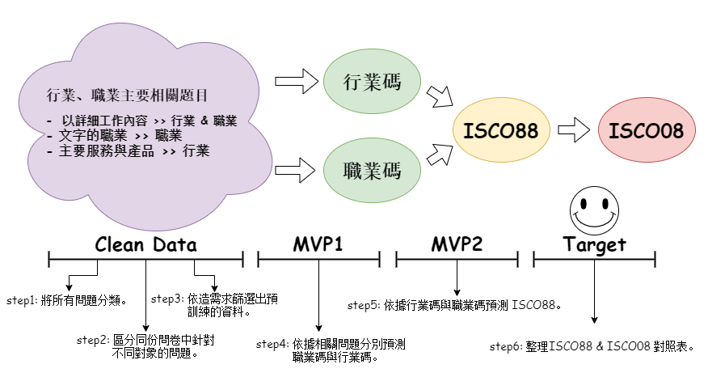

# 處理問卷題目行職業文字推薦對應 ISCO 編碼

> 因為限制的關係不提供原始資料。

# 一、專案簡介

## 目標

依造受訪者填在問卷的資訊，自動區分 **行業碼** 與 **職業碼** 還有 **ISCO代碼**。減少人工去分辨與填寫的人力成本。

## 主要欄位說明

### 1. 職業碼 (社會變遷碼)

- 社會變遷碼是參照行政院主計處「中華民國職業標準分類」改的，大類一樣。
- 主要要大類
    

- 社會變遷碼對照表
    

### 相關資料
- [第6次修訂(99年5月)](https://www.dgbas.gov.tw/ct.asp?xItem=26132&ctNode=3112&mp=1)
- [各職業分類標準說明檔](https://www.dgbas.gov.tw/public/Attachment/141413555071.pdf)
- [淺談社會變遷的職業編碼與社經地位分數](https://wcstatistics.blogspot.com/2018/11/blog-post_19.html)

### 2. 行業碼

- 全名 「中華民國行業標準分類」，為行政院主計處管理。
- 最新版本 2016 年 1月

### 相關資料
- [中華民國行業標準分類](https://www.dgbas.gov.tw/lp.asp?CtNode=3111&CtUnit=566&BaseDSD=7&mp=1)
- [各類說明](https://www.dgbas.gov.tw/public/Attachment/51230162221KI9NIEKP.pdf)

### 3. ISCO-88 & ISCO-88

- 兩者皆為四碼，前後變化不大

### 相關資料
- [主要資料](http://www.zonta.org.tw/download/0809-0205-ZI%20Occupations.pdf)
- [ISCO - International Standard Classification of Occupations](https://www.ilo.org/public/english/bureau/stat/isco/isco08/)

## 主要問題

### 1. 不同期的問卷題目不統一

每年的資料問題內容幾乎都不一樣，期中 **60 個** 檔案，總共有 **22199 題問題**，排除掉重複的題目後也有 **17000 多個問題**，要如何抓取每份問卷需要使用的題目不容易。

### 2. 主要的預測目標欄位，有時間問題

主要預測目標欄位 (ISCO、行業碼、職業碼)，有效時間都不一樣。期中還有包含 recode 過或是新舊的差別，所以我們要先知道哪些年分的資料有包含目標欄位，再由選項判斷是否為同樣的標準。

- **編碼變動**
    - 2003 開始有 `ISCO88`
    - 2014 開始有 `ISCO08 + ISCO88`
    - 2010 開始採用 `新的行業碼` 一直到現在，使用時要特別注意。
- **特殊標記**
    - `recode` 為變遷從新編碼的資料，不是最原始的碼。
        - 範例: 受訪者目前(或以前)工作職位ISCO88(recode)
    - `revise` 為答案有經過轉換的資料，通常都有對應的原始欄位。
        - 範例: 請問您現在的(之前的)職業是什麼?isco88(revised)
    - `新增變項` 感覺跟 recode 一樣。
        - 範例: 受訪者目前(以前/退休前)ISCO08職業碼(新增變項)
    - `新舊` 就是中間有修改過。
        - 範例1: 受訪者剛進公司或機構第一個職位（新）
        - 範例2: 受訪者剛進公司或機構第一個職位（舊）

### 3. 辨別與 ISCO 相關的欄位，並進行分類。

題目因為跨了很多年，有些關鍵字可能只有近幾年再用，要把相關主題的題目抓出來，也不容易。

### 4. 每個問題都有對象，要如何區分，該問題是針對誰。

- 範例 :
    - 您15歲時,父親的職業是什麼?職位(ISCO 88) → 15歲、父親
    - 您配偶現在的職業是什麼?職位(ISCO 88) → 現在、配偶
    - 受訪者第一份工作isco分組 → 第一次、受訪者

### 5. 要選取哪些主題、年分的資料作為訓練。

- 有些問題出現的年份比較少，但感覺蠻重要的
- 題目包括選擇和填空
- 有些身分很少出現，像是媽媽
- 有些主題配對到的題目本來就少

## 整體流程

# 二、資料介紹

## 檔案性質

- 我們以 **限制性資料** 為主，因為一般公開資料資訊較少
- 以 `.sav` 檔案儲存，期中每份檔案可以分成 `標籤檔` 和 `資料檔`
    - 標籤檔
        - **col_name:** 資料檔內對應的欄位名。(recode 過，由英文和數字組成)
        - **col_lab:** 該欄位名稱對應的標籤，也就是問卷上的題目。(由文字組成)
        - **val_lab:** 該題目對應的選項。(為字串的 dict 格式，空的代表填空)
    - 資料檔
        - 儲存對應年分的所有受訪者回答資訊，每個 row 代表一次訪談，每個 column 只有 recode 過的欄位名稱。

## 題目種類

- **預測目標題目 :**
    - ISCO08
    - ISCO88
    - 行業碼
    - 職業碼
- **基本題目 :** 每份問卷都有的，最基本的問題。
    - 調查年度(西元年)
    - 調查波次
    - 問卷別
    - 受訪者編號、樣本編號
- **主要參考題目 :** 這是主要會用的資料，有受訪者填寫的文字內容。
    - 詳細工作內容
    - 公司產品與服務
    - 職位
- **輔助參考題目  :** 參考用，非文字內容
    - 部門
    - 公司員工數
    - 管理員工數
    - 是老闆還是員工？
    - 管理員工與否

# 三、資料清整

---

> 以下所有程式碼都在 `cleandata` 的資料夾下。

## Step1: 資料轉換 SAV → CSV

### 程式碼

`**1_SAVtoCSV.py**`

### 說名

原始檔案幾乎都是分散在 `**社會變遷資料**`資料夾下各子資料夾的多個 `**.sav`** 檔，這個 code 批次將檔案轉為 csv 檔，方便之後使用。

- 補充: `**.sav**` 是 SPSS 輸出的檔案格式。

### 輸出

- 會同時輸出資料與標籤兩種資料，檔名即原始檔名。
- 標籤檔 `**.csv**`
    - **col_name:** 資料檔內對應的欄位名。(recode 過，由英文和數字組成)
    - **col_lab:** 該欄位名稱對應的標籤，也就是問卷上的題目。(由文字組成)
    - **val_lab:** 該題目對應的選項。(為字串的 dict 格式，空的代表填空)
- 資料檔 `**.label.csv**` → 像是 code book
    - 儲存對應年分的所有受訪者回答資訊，每個 row 代表一次訪談，每個 column 只有 recode 過的欄位名稱。

## Step2: 合併 label 檔

### 程式碼

`**2_Combinefiles.py**`

### 說名

將所有標籤資料合併在一起

### 輸出

- *`output/2_all_label_file.csv`*

## Step3: 依造 pattern 抽取個主題相關問題

### 程式碼

**`3_get_main_lab.py`**

### 說明

透過預先設定的 pattern 與對應的主題標籤去對所有問題做貼標籤的動作，找出所有資料中可能會對職業碼與行業碼有影響的題目。

### 輸出

- `*output/3_all_label_clear_col_lab.csv*`
- `*output/3_all_label_match_result.csv*`

## Step4: 標記各問卷的對象和時間點

### 程式碼

`**4_get_person_time.py**`

### 說明

每個問題都有對象，我們這邊使用關鍵字抓取特定幾種 pattern 並標記。

- **身分:** 爸爸、配偶、受訪者、媽媽
- **時間:** 第一次、現在、15歲、結婚時

### 輸出

- `*output/4_all_label_final_result.csv*`
- `*output/4_all_label_match_person.csv*`
- *`output/4_all_label_match_time.csv`*

---

## Step5: 將可以使用的題目編號 - person-id

### 程式碼

`**5_get_id.py**`

### 說明

依造標記的 身分、時間和原始的檔名，把所有題目切割成獨立的個體並編碼，像是 **受訪者15歲** 和 **受訪者現在**，他們是同個檔案的同分問卷，但是他們的時空不同，代表的是兩筆不同的職業資料，這邊我們使用 id 區隔。

### 輸出

- `*output/5_all_id_result.csv*`

## Step6: 輸出訓練資料

### 程式碼

**`6_sort_Traindata.py`**

### 說明

依造 **訓練目標 (y)** 和 **設定條件(要那些標籤 or 年分)** 去抓取對應的資料，我們會將沒有對應的 **訓練目標 (y)** 的 person-id 剔除，依造各個檔案路徑去抓取對應的資料。並輸出訓練資料檢查報表，可以查看目前的條件下篩出來的資料是哪些。

## 步驟

1. 獲取所有的 csv 檔 list
2. for 迴圈對每個檔案 
3. 獲取該檔案配對到的欄位
4. 篩選要配對的欄位（每個person id 一定要包含 target)
5. 讀取對應欄位的資料
6. 按照person id 將該資料中每個獨立的 分出來。
7. 將各個原本欄位名稱換成標籤（isco、職業碼...）。
